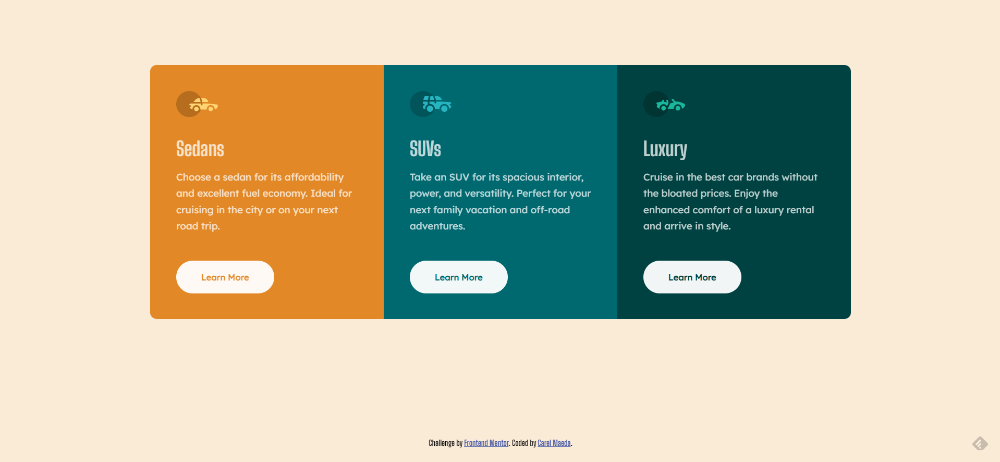
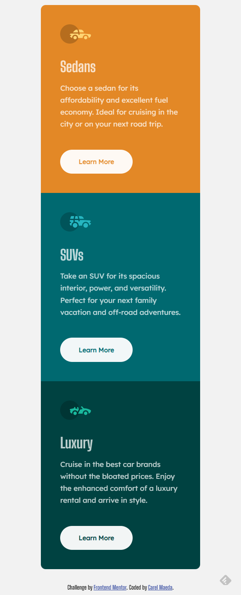

# Frontend Mentor - Product preview card component solution

This is a solution to the [Product preview card component challenge on Frontend Mentor](https://www.frontendmentor.io/challenges/product-preview-card-component-GO7UmttRfa). Frontend Mentor challenges help you improve your coding skills by building realistic projects. 

## Table of contents

- [Overview](#overview)
  - [The challenge](#the-challenge)
  - [Screenshot](#screenshot)
- [My process](#my-process)
  - [Built with](#built-with)
  - [What I learned](#what-i-learned)
- [Author](#author)

**Note: Delete this note and update the table of contents based on what sections you keep.**

## Overview

I am using the website Front End Mentor in order to practice my Front End skills.

### The challenge

Users should be able to:

- View the optimal layout depending on their device's screen size
- See hover and focus states for interactive elements

### Screenshots

Here are both views of my Project

## My process

This Project was developed with a **Mobile-first workflow**, then it was optimized for Desktop using media queries.

### Built with

- Semantic HTML5 markup
- CSS custom properties
- Flexbox
- CSS Grid
- Mobile-first workflow

### What I Learned

This challenge was important for me to learn how to build cards using responsive grids layouts.
One important asset that I used and I am super proud of is the primary button with a transparent text. This was acheieve using ( mix-blend-mode: screen );

## Author

Carel Maeda
- Frontend Mentor - [@carelmaeda](https://www.frontendmentor.io/profile/carelmaeda)

